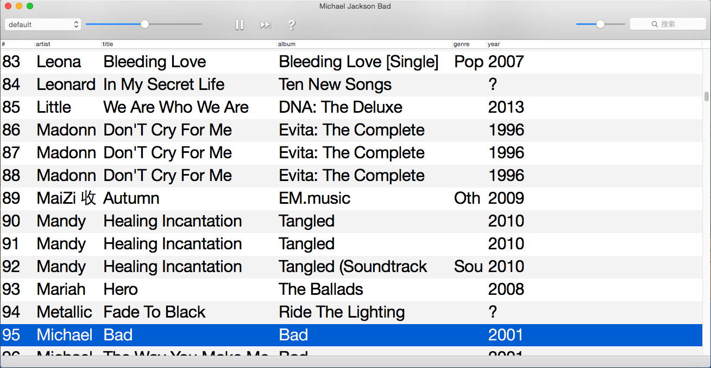

#uPlayer   

    

A audio player for Mac Os x.  

Last.fm scrobbling and global key blinding is supported.

##Download  

[Latest Releases](https://github.com/uPlayer/uPlayer/releases/latest)  

##Advance fetures  

* Global key blinding:  
uPlayer use a json format config file.  
You can find it in Menu uPlayer/KeyBlindings.  
This is the default codes:  

		{
		  "super+d" : "to_play_random",
	      "super+e": "to_play_pause_resume"
		}

You can change it yourself. Make sure all words is *lowecased*.

* Last.fm:  
	 
	 * uPlayer will scrobble songs when played half of time or 40 seconds.  
	 * uPlayer will send "nowPlaying" message to last.fm when a track started.
	 * You can also mark a song loved via menu "Love @ Last.fm"

##System  

Only tested in OS X 10.10 Yosemite  

##How to build This Project  

1. Clone this project 
		
		git clone https://github.com/uPlayer/uPlayer.git 
	
	 and change your directory and update the pods:
	 
		 pod update
	 
2. Download and build [taglib](www.taglib.com). It quite easy if you use [homebrew](http://brew.sh) to install to /usr/local.   
 
		  brew install taglib

3. Open uPlayer.xcworkspace for this project.   
	  👍

##License   
Attribution  
   
NonCommercial  
   
ShareAlike   
  

